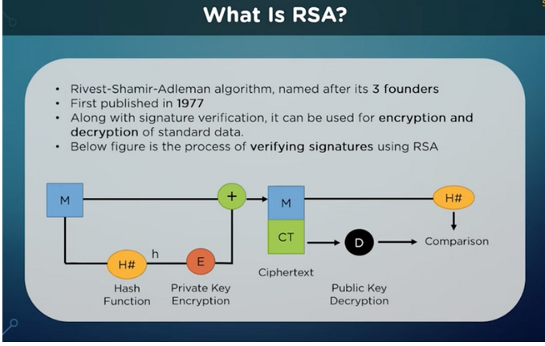
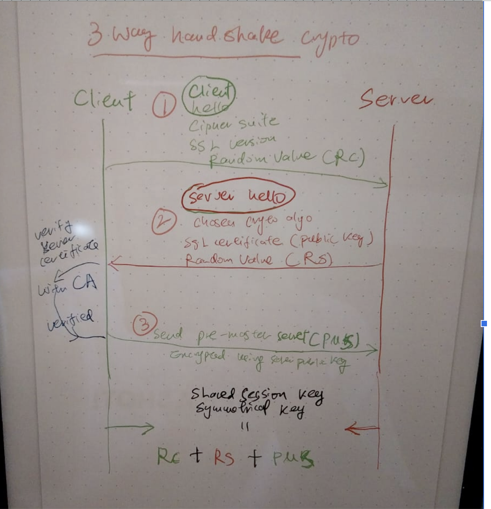

# CrytoNotes


In macOS, a **root certificate** is typically presented as a `.cer`, `.crt`, or `.pem` file, and it is stored in the **System keychain** or **System Roots** keychain. You can view it using the **Keychain Access** app.

### 🧭 How to View a Root Certificate on macOS:

1. Open **Keychain Access**:

   * Press `Cmd + Space`, type **Keychain Access**, and hit `Enter`.

2. In the left sidebar, select **System Roots**.

3. Click **Certificates** in the lower category list.

4. You'll see a list of root certificates (e.g., `Apple Root CA`, `DigiCert Global Root CA`, etc.).

5. Double-click a certificate to inspect it. You’ll see:

   * **Name**
   * **Expiration Date**
   * **Public Key Info**
   * **Fingerprints (SHA-1, SHA-256)**
   * **Trust Settings**

---

### 📄 Example View (in plain text / PEM format):

If you export a root certificate (right-click > Export), it might look like this in **PEM format**:

```
-----BEGIN CERTIFICATE-----
MIIDdTCCAl2gAwIBAgIJAO2EZU28qvHoMA0GCSqGSIb3DQEBCwUAMFgxCzAJBgNV
...
JXcMeXQdlPVR1L5X7RKuMguEbXbGeVEkJTXvD7s=
-----END CERTIFICATE-----
```

---

### 📁 Where macOS Stores Root Certificates:

* **System keychain path**: `/Library/Keychains/System.keychain`
* **System Roots keychain path**: `/System/Library/Keychains/SystemRootCertificates.keychain`

These files are not meant to be edited manually. Use **Keychain Access** or CLI tools like `security` or `certtool` for safer operations.

---


The error message:

> **SSL certificate problem: unable to get local issuer certificate**

means that the client (e.g. `curl`, `git`, a browser, etc.) **cannot verify the authenticity of the server’s SSL certificate** because it **does not trust the certificate authority (CA)** that issued it. This usually happens when:

### 🔍 What it means:

* The client is trying to connect to an HTTPS server.
* The server presents a certificate.
* The client tries to verify the certificate using a **chain of trust**.
* But it **fails to find or validate the issuer (CA) certificate** locally.

### 🧾 Common Causes:

1. **Missing or outdated CA certificates** on your system.
2. The server’s SSL certificate is **misconfigured** (e.g. missing intermediate certificates).
3. You’re using `curl`, `git`, or other tools that **don’t know where to find the CA bundle**.
4. On Windows, sometimes **Git for Windows or curl** can't find the certs.

---

### ✅ How to Fix It:

#### **1. Update CA certificates (Linux/macOS):**

```bash
sudo update-ca-certificates     # Debian/Ubuntu
sudo trust extract-compat       # Red Hat/Fedora
```

#### **2. For `curl`:**

Make sure it's using the correct CA bundle:

```bash
curl --cacert /etc/ssl/certs/ca-certificates.crt https://example.com
```

#### **3. For `git` (Windows or custom installs):**

Configure Git to use a valid CA bundle:

```bash
git config --global http.sslCAInfo "/path/to/cacert.pem"
```

You can download the `cacert.pem` from: [https://curl.se/ca/cacert.pem](https://curl.se/ca/cacert.pem)

#### **4. Temporarily ignore (⚠️ not recommended for production):**

```bash
curl -k https://example.com        # disables certificate check
git -c http.sslVerify=false clone https://repo
```

> ⚠️ This skips SSL verification and **makes you vulnerable to man-in-the-middle attacks**.

---

Let me know your exact environment (e.g. using Git, curl, Python, OS type), and I can give a more targeted fix.


Yes — **root CAs installed in your local machine are the foundation of the SSL/TLS chain of trust**.

---

### 🔐 What are **Root CAs**?

A **Root Certificate Authority (CA)** is a **trusted organization** that issues digital certificates. These root certificates are:

* **Self-signed** (they sign themselves).
* **Pre-installed** in your operating system or browser.
* Used to **verify the authenticity** of SSL certificates presented by websites or services.

---

### 🧱 What is the **Chain of Trust**?

When you visit an HTTPS site or use a secure connection:

1. The **server** sends its **SSL certificate**.
2. That certificate may be **signed by an Intermediate CA**.
3. That Intermediate CA is signed by another, **up to a Root CA**.
4. Your system **checks the chain** until it hits a **trusted Root CA** already installed locally.
5. If no match is found — you get an error like:

   > `SSL certificate problem: unable to get local issuer certificate`

---

### 🗂️ Where are Root CAs stored?

#### On **Linux**:

* Common locations:

  * `/etc/ssl/certs/ca-certificates.crt` (Debian/Ubuntu)
  * `/etc/pki/tls/certs/ca-bundle.crt` (Red Hat/CentOS)
* Managed via:

  ```bash
  sudo update-ca-certificates      # Debian-based
  sudo trust anchor ...            # Red Hat-based
  ```

#### On **macOS**:

* Managed via **Keychain Access**.
* Stored in: **System Roots > Certificates**.
* View with:

  ```bash
  security list-keychains
  security find-certificate -a -p /System/Library/Keychains/SystemRootCertificates.keychain
  ```

#### On **Windows**:

* Stored in the **Windows Certificate Store**.
* View via:
  `certmgr.msc` → Trusted Root Certification Authorities → Certificates

#### In **Browsers** (like Firefox):

* Firefox **uses its own** root CA store, separate from the OS.

---

### 🧪 Check the chain of a certificate:

You can inspect a website’s certificate and full chain with:

```bash
openssl s_client -connect example.com:443 -showcerts
```

---

### ✅ Summary:

| Concept           | What it means                                           |
| ----------------- | ------------------------------------------------------- |
| Root CA           | A trusted certificate authority, pre-installed locally. |
| Chain of trust    | Path from server cert → intermediate CA → root CA.      |
| Local trust store | The list of root CAs your OS or tool trusts.            |
| SSL errors        | Occur when the client can’t verify the full chain.      |

Let me know your OS or tool (curl, git, browser, etc.) if you'd like to check your actual root CAs or debug trust issues.


Great question — **SAML** and **OIDC** are both **authentication protocols** used for **Single Sign-On (SSO)** and identity federation. They let users log in once and access multiple systems without having to log in again.

Here’s a breakdown of each:

---

### 🔐 **SAML** (Security Assertion Markup Language)
- **Used by**: Enterprises, legacy systems, older SSO systems.
- **Format**: XML-based.
- **Flow**:
  1. User tries to access an app (called the **Service Provider**, or SP).
  2. App redirects the user to a **Identity Provider (IdP)** (e.g., Okta, ADFS).
  3. User logs in there.
  4. IdP returns a **SAML assertion** (XML token) saying, "Yes, this user is authenticated."
  5. App trusts that token and logs the user in.

- **Good for**: Older enterprise apps, especially ones that were built before modern APIs.

---

### 🌐 **OIDC** (OpenID Connect)
- **Used by**: Modern apps, mobile, cloud-native systems.
- **Format**: JSON-based (built on top of OAuth 2.0).
- **Flow**:
  1. User tries to log in.
  2. App redirects them to an **OIDC Provider** (like Google, Auth0, AWS Cognito).
  3. User logs in.
  4. Provider returns a **JWT token** (ID Token) with user info.
  5. App uses this token to authenticate the user.

- **Good for**: Web and mobile apps, APIs, anything modern.

---

### 🥊 SAML vs OIDC (Quick Comparison)

| Feature              | SAML                     | OIDC                          |
|----------------------|--------------------------|-------------------------------|
| Data format          | XML                      | JSON / JWT                    |
| Built on             | Custom XML-based protocol| OAuth 2.0                     |
| Token type           | SAML Assertion           | ID Token (JWT)                |
| Use case             | Enterprise SSO           | Web/Mobile/App authentication |
| Simpler to implement | ❌ Not really             | ✅ Yes                         |
| Modern support       | ⚠️ Limited                | ✅ Excellent                   |

---

### 🧠 TL;DR:
- **SAML** = older, XML-based, enterprise SSO.
- **OIDC** = modern, JSON/JWT-based, used in web/mobile/cloud apps.

If you're building or integrating SSO into a system today, **OIDC is generally the preferred option** unless you're stuck with older enterprise requirements.


## Cryptography what is it
Science of scrambling message beyond recognition

some terms:
- plaintext (orignal message that could be read)
- ciphertext (encrypted message)
- decryption key (use this key to decrypt ciphertext into plaintext)
- two types of encryption
1. Symmetrical - same key shared across two persons
2. Asymmetrical - different key shared across two persons e.g. RSA
   - most commonly known as PKI (Public key infrastructure)
   - Public key - Sender uses receiver's public key to encrypt message
   - Private key - Receiver uses its own private key to decrypt the message
  
## symmetrical encryption (SE)
There are two kinds of ways to encrypt the message
1. block cipher - segment the message into blocks of bits, and then encrypt it
2. stream cipher - encrypt message bit by bit

AES 256, Advanced Encryption Standards, is the most commonly used standards nowdays, replacing DES (Data Encryption Standards, which is cracked by brute force due to rising computer power).

SE is also called the private key infrastructure (because only 1 key).

As SE is faster than AE below, below are some of its applications:
1. Bank transaction - fast
2. Encrypt server data - fast for large amounts of data
3. HTTPS encryption - fast for large streams of data

## asymmetrical encryption (AE)
Most commonly known as PKI with a public and private key.
RSA is the most commonly used PKI standards. However, RSA uses block cipher and slower than AES (symmetrical encryption).

As you shall see later, nowdays symmetrical and asymmetrical encryptions are commonly used together due to its strength and speed:
- Asymmetrical - high defence strength but slower
- Symmetrical - relatively lower defence strength but faster

SSL uses a combination of symmetrical and asymmetrical encryptions for 3 way handshake.

For example, AE could be used to share SE key
- Sender uses receiver's public key to encrypt the SE Key
- Receiver uses its own private key to decrypt the SE key
- So both ends have the plaintext key

## Hashing
Hashing is a method/function to scramble data beyond recognition.
- Hashing always return fixed value
- Irreversible -> You cannot reverse output to its input
- Commonly used to hash passward into digest to be stored in database

Digest is the output from the hash function.

### Hashing is a standard way to store password on database
- Admin also cannot see the password
- There is no way to reverse the cipher password
- There is no decryption key

How is password stored in database?
- when new password is created and it went through a hash function, to be stored as digest in the database
- When users tried to log in with a password, which went through the same function to get digest 2
- Digest is compared with digest 2 to verify the identify of an user

### Hashing is used for check data intergrity
Hashing could take in a file to generate a checksum - always-same-length string.

### There are 2 types of algo for hashing
- MDS
- SHA 256 (secure hashing algorithm 256)

### Hashing function guidelines
- Consistent output for the same input
- must be fast
- Small change in original text will result in large change in digest
- Able to prevent hash collision

### How salting and peppering is used to prevent hash collision
1. Salting - adding random value to the end of a text
```
const password = "password123";
const salt = "randomSaltValue";
const saltedPassword = password + salt; // Combine password and salt
const hash = SHA256(saltedPassword); // Hash the salted password
```
2. Peppering - adding some fixed value to the end of a text
Peppering can be extremely secure, where you could store the value in the system, not the source code
Or you could store the value in key vault for rotation to prevent hacking.
```
const password = "password123";
const salt = "randomSaltValue";
const pepper = "secretPepper"; // A fixed value known only to the system
const saltedPepperedPassword = password + salt + pepper; // Combine password, salt, and pepper
const hash = SHA256(saltedPepperedPassword); // Hash the salted and peppered password
```

Salting and peppering is commonly used together.

## Digital signature
It is a way to verify the authencity of the document.
There are 2 kinds of algo:
1. RSA (Rivest–Shamir–Adleman)
2. DSA (Digital signature algorithm)

How does DSA works? It is mainly the reverse of the usual PKI flow.
- Server encrypts a document using private key into ciphertext
- Client decrypts the ciphertext using the public key to see the plaintext

How does RSA work for digital signature?
- Slightly more complicated than DSA by adding in hash function
- On sender's side, orignal message M is hashed into a digest 1, which is then encrypted using its own private key as ciphertext
- The payload to be sent consists of M + ciphtertext
- Receiver received the payload
1. Use the same hash function to hash the M into digest 2
2. Then decrypt the ciphertext from the payload using sender's public key into digest 1
3. Then compares digest 2 with digest 1 to verify the originality of the document


## FiDO
FiDo is fast identity online - it is a way to do away with password, by using public key infrastructuure for authentication.

## U2F
Universal Second Factor authentication - after keying in password, use sms or Yubikey as the second layer of protection.

## SAML (Security Assertion Markup Language) - authenticate once and tell all application this person is legit
- SAML, is a standardized way to tell external applications and services that a user is who they say they are. 
- SAML makes single sign-on (SSO) technology possible by providing a way to authenticate a user once and then communicate that authentication to multiple applications. 
- The most current version of SAML is SAML 2.0.

SAML is esp useful in micro-service cloud environment, where we just need to authenticate the user once, but he/she could use all the services in the cloud.

## SSO (Single Sign-on)
- Single sign-on (SSO) is a way for users to be authenticated for multiple applications and services at once. 
- With SSO, a user signs in at a single login screen and can then use a number of apps. Users do not need to confirm their identity with every single service they use.
- For this to take place, the SSO system must communicate with every external app to tell them that the user is signed in — which is where SAML comes into play.

## Idp (identity provider)
- An identity provider (IdP) is a cloud software service that stores and confirms user identity, typically through a login process. 
- Essentially, an IdP's role is to say, "I know this person, and here is what they are allowed to do."

## How does SAML work
A typical SSO authentication process involves these three parties:
- Principal (also known as the "subject") - user trying to login
- Identity provider e.g. AWS idp
- Service provider e.g. AWS cloud service or cloud hosted application e.g. Gmail or Ms office 365, Slack

Ordinarily a user would just log in to these services directly, but when SSO is used, the user logs into the SSO instead, and SAML is used to give them access instead of a direct login.
So user -> SSO (behave like a server) -> SAML (standardize ways)

Here is the flow [p -> SP request auth letter -> idp (SAML assertion/reference letter) -> SP (p verified by letter) -> p (you can log in now)]:
- The principal makes a request of the service provider. 
- The service provider then requests authentication from the identity provider. 
- The identity provider sends a SAML assertion to the service provider, and the service provider can - then send a response to the principal.
- If the principal (the user) was not already logged in, the identity provider may prompt them to log in before sending a SAML assertion.

## SAML assertion is just like a reference letter from Idp to service provider
- A SAML assertion is the message that tells a service provider that a user is signed in. 
- SAML assertions (mark up language just like HTTP code to be consumed by service provider server) contain all the information necessary for a service provider to confirm user identity, including the source of the assertion, the time it was issued, and the conditions that make the assertion valid.
- Think of a SAML assertion as being like the contents of a reference for a job candidate: the person providing the reference says when and for how long they worked with the candidate, what their role was, and their opinion on the candidate. Based on this reference, a company can make a decision about hiring the candidate,

## difference between Authen (Authenticate somebody) and Author (authorize some permissions)
- Authentication refers to a user's identity: who they are and whether their identity has been confirmed by a login process.

- Authorization refers to a user's privileges or permissions: specifically, what actions they are allowed to perform within a company's systems.

## 3 way handshake crypto SSL
1. Client initiate a hello to server with
- Cipher suite (available crypto algo on my side)
- SSL version (what version do i have)
- Random value from client (RC for now)

2. Server send hello back to client with
- Chosen crypto algo among cipher suite
- SSL certificate (with public key stored inside)
- Random value from server (RS for now)

3. Client sends:
- Pre-master secret (PMS), which is encrypted using Server's public key

The final step is to establish a symmetrical encryption key for speed, so both sides have the same key
```
Same key = RC + RS + PMS
```
In above steps, they are mixture of asmmetrical and symmetrical methods, commonly used in modern crypto:
- we have used Asymmetrical method (PKI) to encrypt PMS
- We have used DHKE (Diffe Hellman Key Exchange) Algo to share the same key
- Finally, we are using symmetrical key for SSL for speed
  


## What is DHKE (Diffe Hellman Key Exchange) Algo to share the same key
The objective to pass the symmetrical key from insecure channels from one person to another.

Person A has
| Individual Private key       | Common Public key  |
|------------|------|
| Pr1  | Pu   |

Person B has
| Individual Private key       | Common Public key  |
|------------|------|
| Pr2  | Pu   |

Note that Person A and Person B have a common public key. 
- So Person A mixes its private and public keys together and send over the mixture Mix1 to Person B.
- If a hacker intercept the mixture, he/she cannot separate the private key from the public key
- And Person B mixes its private and public keys together and send over the mixture Mix2 to Person A.
- After adding their individual private key to the mixture, each person would have a common mixture composed of 3 parts

For example Person A would have a mixture of
1. Pr2
2. Pu
3. Pr1

Person B would have a mixture of 
1. Pr1
2. Pu
3. Pr2

## PKI overview

### What is a certificate in PKI
In SSL, a certificate is used to verify the authencity of the server. It contains:
```
- Public key
- Entity info: ABC company
- Issuer: One of the Known CAs (Certified Authority)
- Validity period
- Digital signature (CA sign the cert with its private key. Anyone with CA's public key to verify that it comes from the CA)
```


#### How does CA signing the cert enables server authentication?

Server requests CSR (Certificate signing request) to CA
- Server sends its public key and domain info (name etc.)

CA signed the cert by signing the cert using CA's private key
- CA passes the Server payload (public key and domain info) into a hash function to get a digest
- Then encrypt the digest using its private key
- The end result is the digital signature
- So CA sends back a payload of 1. public key 2. server info 3. digital signature

On client browser's side:
1. Browser also has pre-installed root certificates which contains CA and its public key
2. Root certificate is a certificate from CA (Entity is CA and Issued by CA itself)
3. When browser initiate request to server
4. Server sends back its signed cert to browser
5. Browser look through its root certificates to find the relevant CA
6. Then use that CA's public key to verify the server certificate's digital signature.
- Use server public key to decrypt the signature into hash digest
- Compare with the computed digest of the certificate data

### What is root cert?
The cert is:
- signed by CA
- Issued by CA
- Foundation of all cert issued by the CA
- They are pre-installed in the browser\

### what is certificate chain
3 levels:
- Root cert - belong to CA and preinstalled (trusted) by browser
- Immediate cert - imterdiate between root and leaf cert, usually signed by root cert to issue leaf cert. Root cert can delegate signing task to immediate cert, which might be responsible for a specific domain. If a immediate cert is compromised, the root cert is safe, acting as a chain of trust.
- Leaf cert (for SSL/TSL) - actual SSL/TLS cert used by a server for handshake

What is the use of segmenting above?
- Ensure a hierarchy chain of trust, harder to compromise the trust

## why do we sometimes need to manually install root cert in browser
It could be in internal dev env, we are telling browser that we trust this CA
- could be self-signed CA
- Could be an entirely internal CA itself

### what is the purpose of cert
- Authentication - we could identify the sources
- Encryption - use public key to encrypt data
- Digital signature - verify it is coming from legit sources

### Too many cert, how to manage
We could use keychains to store and manage crypto keys.
For example, MacOS has key chain management and iCloud also has.

Key vault is another way to secure and manage keys like API key, password, certrificates and other secrets.

Database wallet is another way, which might come with periodical key rotation. For example, Oracle Database Wallet, which stores encryption key which encrypt the database data.
Application first needs to connect to database wallet to get credentials before accessing the database.

### Types of cert file
`.crt` mainly used for SSL,, containing public key, entity info and digital signature by CA

`.key` usu to contain public key

`.pem` similar to `.crt`

`.pfx/.p12` These are PKCS#12 files that often bundle both the certificate and private key in one encrypted file.

### what is a bastian host
The term "bastion host" comes from military architecture, where a bastion is a fortified place designed to protect vulnerable parts of a fortress. In computer networking, a bastion host plays a similar role—it acts as a fortified or secure server that sits on the edge of a network, protecting the internal network from external threats.

Bastian host is also called jump server or jumbox.
- why jump? because your first ssh into bastian host, then jump from jump server to remote server


Why bastian host is a fortified place?
- Higher security - It has hardened security, because the bastian host is reduced to essential services to reduce surface attack from hackers.
- It tracks all traffics for internal audit and logs (like anyone passing through the gate of a castle)
- Centralized access control - we could control who could acess what instances through the bastian host, instead of adjusting user control at remote instance level

### Then how do we use SSH command to jump into remote server behind bastian host
We could include below config lines into `~.ssh/config` in macOS. When we run `ssh remote-server`, we could connect to bastian host and then tunnel towards remote server.
- The above SSH command assumes that we have SSH agent in place.

```
Host remote-server
  HostName remote-server.com
  User <username>
  ProxyCommand ssh bastion.com -W %h:%p
```

Having to many lines in 1 singel file `~/.ssh/config` might be too hard to read. So you could create many different `.config` files in other folders. And in `~/.ssh/config`, just putting in the below line, indicating to include the config lines from these files. So when you run `ssh someOtherHost`, ssh will look into below files as well to find the match.
```
Include anyfolder/anyHostNames.config
```

### what happened behind the scenes when you run `ssh remote-server` in the terminal
1. SSH first looks for Host block `remote-server` in `~/.ssh/config`, or any other inclusion files
2. When a match `remote-server` is found, ssh applies setting from that block
3. Resolve actual server name from `remote-server` to `remote-server.com`
4. Set the username as the username to log in remote-server.com
5. Run proxy command to connect via bastian host
- Open ssh to connect to bastion.com
- Forward traffic from `bastion.com` to remote host
- -W instruces SSH to forward the connection to target host and port
- %h is the placeholder for `remote-server.com`
- %p is the placeholder for the port (by default SSH is port 22)

### what is openssh
Openssh is a command utility in terminal, which contains many functions such as SSH, SCP and tunnel etc.

### What is PCKS11
It is an API for you to interact with crypto security token such as smart cards, USB key and yubikey, usually used to read or delete the keys.

### ZBT 
Zero Based Trust - always distrust unless proving otherwise

### FIPS
Federal Information Processing Standard - US and Canadian government security requirement for crypto modules.
