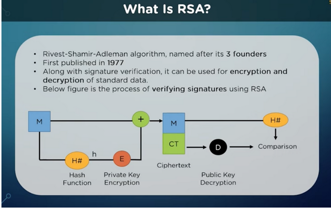

# CrytoNotes

## Cryptography what is it
Science of scrambling message beyond recognition

some terms:
- plaintext (orignal message that could be read)
- ciphertext (encrypted message)
- decryption key (use this key to decrypt ciphertext into plaintext)
- two types of encryption
1. Symmetrical - same key shared across two persons
2. Asymmetrical - different key shared across two persons e.g. RSA
   - most commonly known as PKI (Public key infrastructure)
   - Public key - Sender uses receiver's public key to encrypt message
   - Private key - Receiver uses its own private key to decrypt the message
  
## symmetrical encryption (SE)
There are two kinds of ways to encrypt the message
1. block cipher - segment the message into blocks of bits, and then encrypt it
2. stream cipher - encrypt message bit by bit

AES 256, Advanced Encryption Standards, is the most commonly used standards nowdays, replacing DES (Data Encryption Standards, which is cracked by brute force due to rising computer power).

SE is also called the private key infrastructure (because only 1 key).

As SE is faster than AE below, below are some of its applications:
1. Bank transaction - fast
2. Encrypt server data - fast for large amounts of data
3. HTTPS encryption - fast for large streams of data

## asymmetrical encryption (AE)
Most commonly known as PKI with a public and private key.
RSA is the most commonly used PKI standards. However, RSA uses block cipher and slower than AES (symmetrical encryption).

As you shall see later, nowdays symmetrical and asymmetrical encryptions are commonly used together due to its strength and speed:
- Asymmetrical - high defence strength but slower
- Symmetrical - relatively lower defence strength but faster

SSL uses a combination of symmetrical and asymmetrical encryptions for 3 way handshake.

For example, AE could be used to share SE key
- Sender uses receiver's public key to encrypt the SE Key
- Receiver uses its own private key to decrypt the SE key
- So both ends have the plaintext key

## Hashing
Hashing is a method/function to scramble data beyond recognition.
- Hashing always return fixed value
- You cannot reverse output to its input
- Commonly used to hash passward into digest to be stored in database

Digest is the output from the hash function.

## Digital signature
It is a way to verify the authencity of the document.
There are 2 kinds of algo:
1. RSA (Rivest–Shamir–Adleman)
2. DSA (Digital signature algorithm)

How does DSA works? It is mainly the reverse of the usual PKI flow.
- Server encrypts a document using private key into ciphertext
- Client decrypts the ciphertext using the public key to see the plaintext

How does RSA work for digital signature?
- Slightly more complicated than DSA by adding in hash function
- On sender's side, orignal message M is hashed into a digest 1, which is then encrypted using its own private key as ciphertext
- The payload to be sent consists of M + ciphtertext
- Receiver received the payload
1. Use the same hash function to hash the M into digest 2
2. Then decrypt the ciphertext from the payload using sender's public key into digest 1
3. Then compares digest 2 with digest 1 to verify the originality of the document


## FiDO
FiDo is fast identity online - it is a way to do away with password, by using public key infrastructuure for authentication.

## U2F
Universal Second Factor authentication - after keying in password, use sms or Yubikey as the second layer of protection.

## SAML (Security Assertion Markup Language) - authenticate once and tell all application this person is legit
- SAML, is a standardized way to tell external applications and services that a user is who they say they are. 
- SAML makes single sign-on (SSO) technology possible by providing a way to authenticate a user once and then communicate that authentication to multiple applications. 
- The most current version of SAML is SAML 2.0.

SAML is esp useful in micro-service cloud environment, where we just need to authenticate the user once, but he/she could use all the services in the cloud.

## SSO (Single Sign-on)
- Single sign-on (SSO) is a way for users to be authenticated for multiple applications and services at once. 
- With SSO, a user signs in at a single login screen and can then use a number of apps. Users do not need to confirm their identity with every single service they use.
- For this to take place, the SSO system must communicate with every external app to tell them that the user is signed in — which is where SAML comes into play.

## Idp (identity provider)
- An identity provider (IdP) is a cloud software service that stores and confirms user identity, typically through a login process. 
- Essentially, an IdP's role is to say, "I know this person, and here is what they are allowed to do."

## How does SMAL work
A typical SSO authentication process involves these three parties:
- Principal (also known as the "subject") - user trying to login
- Identity provider e.g. AWS idp
- Service provider e.g. AWS cloud service or cloud hosted application e.g. Gmail or Ms office 365, Slack

Ordinarily a user would just log in to these services directly, but when SSO is used, the user logs into the SSO instead, and SAML is used to give them access instead of a direct login.
So user -> SSO (behave like a server) -> SAML (standardize ways)

Here is the flow [p -> SP request auth letter -> idp (SAML assertion/reference letter) -> SP (p verified by letter) -> p (you can log in now)]:
- The principal makes a request of the service provider. 
- The service provider then requests authentication from the identity provider. 
- The identity provider sends a SAML assertion to the service provider, and the service provider can - then send a response to the principal.
- If the principal (the user) was not already logged in, the identity provider may prompt them to log in before sending a SAML assertion.

## SAML assertion is just like a reference letter from Idp to service provider
- A SAML assertion is the message that tells a service provider that a user is signed in. 
- SAML assertions (mark up language just like HTTP code to be consumed by service provider server) contain all the information necessary for a service provider to confirm user identity, including the source of the assertion, the time it was issued, and the conditions that make the assertion valid.
- Think of a SAML assertion as being like the contents of a reference for a job candidate: the person providing the reference says when and for how long they worked with the candidate, what their role was, and their opinion on the candidate. Based on this reference, a company can make a decision about hiring the candidate,

## difference between Authen (Authenticate somebody) and Author (authorize some permissions)
- Authentication refers to a user's identity: who they are and whether their identity has been confirmed by a login process.

- Authorization refers to a user's privileges or permissions: specifically, what actions they are allowed to perform within a company's systems.

## 3 way handshake crypto SSL
1. Client initiate a hello to server with
- Cipher suite (available crypto algo on my side)
- SSL version (what version do i have)
- Random value from client (RC for now)

2. Server send hello back to client with
- Chosen crypto algo among cipher suite
- SSL certificate (with public key stored inside)
- Random value from server (RS for now)

3. Client sends:
- Pre-master secret (PMS), which is encrypted using Server's public key

The final step is to establish a symmetrical encryption key for speed, so both sides have the same key
```
Same key = RC + RS + PMS
```
In above steps, they are mixture of asmmetrical and symmetrical methods, commonly used in modern crypto:
- we have used Asymmetrical method (PKI) to encrypt PMS
- We have used DHKE (Diffe Hellman Key Exchange) Algo to share the same key
- Finally, we are using symmetrical key for SSL for speed
  


## What is DHKE (Diffe Hellman Key Exchange) Algo to share the same key
The objective to pass the symmetrical key from insecure channels from one person to another.
